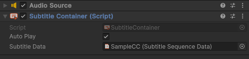

# Subtitle Containers
These are world objects, which contain data about what subtitles to play. They do not contain playing logic. Example implementation of this is available through the SubtitleContainer component.

### SubtitleContainer Component

This object either calls Subtitler to play its SubtitleSequence on Start() or, if you choose, manually through 
`SubtitleContainer.Play();`.

#### Setting up Range-Limiting and Occlusion SubtitleContainer
Subtitler allows you to cull subtitles automatically if they become hard to hear. Culling does not mean subtitles will not be 'played', they will just not be displayed on the UI. 
This is done by checking the AudioSource associated with the SubtitleContainer. A list of properties evaulated is as follows:

| AudioSource | Description |
| --- | --- |
| Spatial Blend | Value of 1 forces range-limiting. |
| Max Distance | If player distance exceeds max distance (and 3D Mix is set to 1), the subtitle entry will not be visible. |
| Volume | If the volume is currently low, the entry will not be displayed. | 
| Enabled | If the AudioSource is not enabled, the entry will not be shown. | 