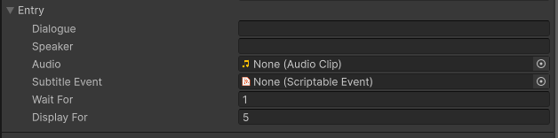
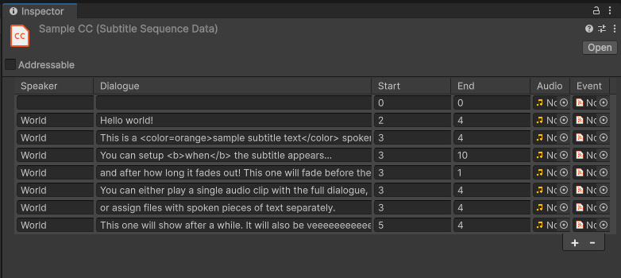

# Data
Data of subtitler is represented either as a standalone entry or a sequence of entries.

## Subtitler Entry

This struct represents a single line of Closed-Captions. It contains information on timing (when to play the subtitle relative to previous, if any), events (things which you want triggered upon playing this line of the Subtitle, like Achievments or an NPC becoming hostile) and the speaker who spoke the line (if any).

## Subtitler Sequence
Sequences are ScriptableObjects and are the recommended way to create subtitles. Under the hood, it contains a list of SubtitlerEntries which are played top-to-bottom.

| Parameter | Description |
| -- | -- |
| Speaker      | Name of the entity which speaks, displayed highlighted on closed-captions. Leave empty to omit.|
| Dialogue   | Closed Caption text content. Be it dialogue or sounds.        |
| Start   | Delay after which this entry will be displayed, relative to Start of last Subtitle Entry.        |
| End | How long will this Subtitle be displayed for?
| Audio | If included, Subtitler will play an AudioClip with this Entry. (For this to work, a reference to an AudioSource must be passed along as an argument. Refer to [containers](containers.md) or API reference for more info.)
| Event | An event to be played when this Subtitle is displayed. See [Events](event.md)