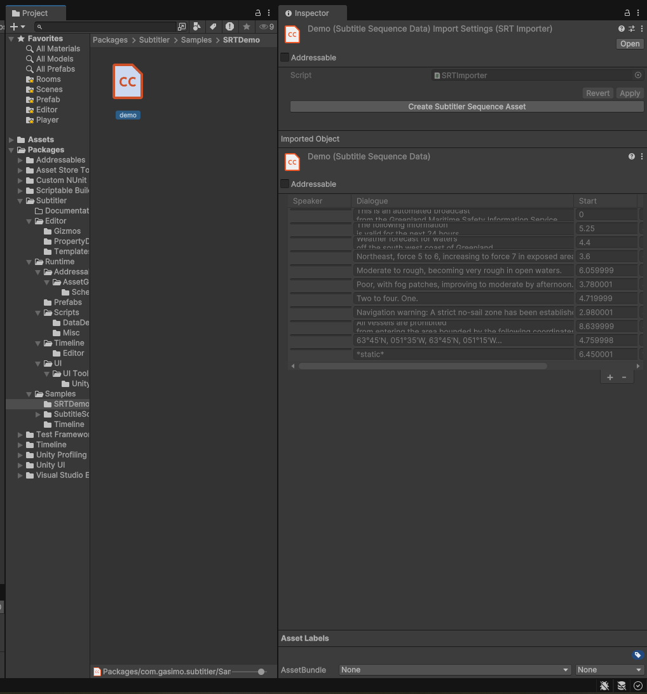

# SRT Support
SRT files will be automatically associated with Subtitler upon import. This uses Unity's ScriptedImporter API. In order to convert srt assets to Subtitler's Sequences, click the srt file and in the import menu press the **Create Subtitler Sequence Asser**.

