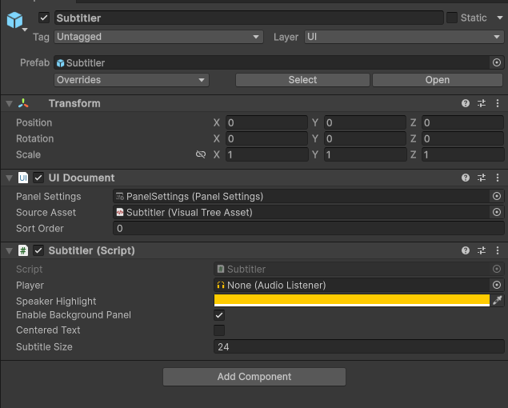

# Subtitler Prefab
In order to use Subtitler, you need to drag the Subtitler Prefab from the package into the scene. Alternatively, you can copy the prefab from the provided Samples.

The Subtitler component exposes some commonly changed properties such as font-size, background visibility and text alignment. 

## Changing Visuals
Subtitler exposes some commonly changed properties like font-size, text alignment (centered/left-aligned) and speaker highlight color.

#### Subtitler does not render on top of my UI when I dont want it to and vice-versa
Change Subtitler's UIDocument Sort Order

#### Change Font
To be exposed in future update

#### Advanced: I wish to change the UI in depth / integrate Subtitler into my own UIToolkit document
If you wish to modify any visual property, you will need to copy the whole Subtitler VisualTreeAsset and USS styling sheets into your own  UIToolkit document. When modifying, make sure to include the same classes and overriden values as the original document to gurantee proper layouting. This mostly means margins, transitions and MaxHeight properties, which are used by Subtitler extensively. 
Keep on mind that all children of Subtitler VisualElement are cleared and that Labels are created and initialized at runtime, not copied from any Labels currently under the Subtitler VisualElement.