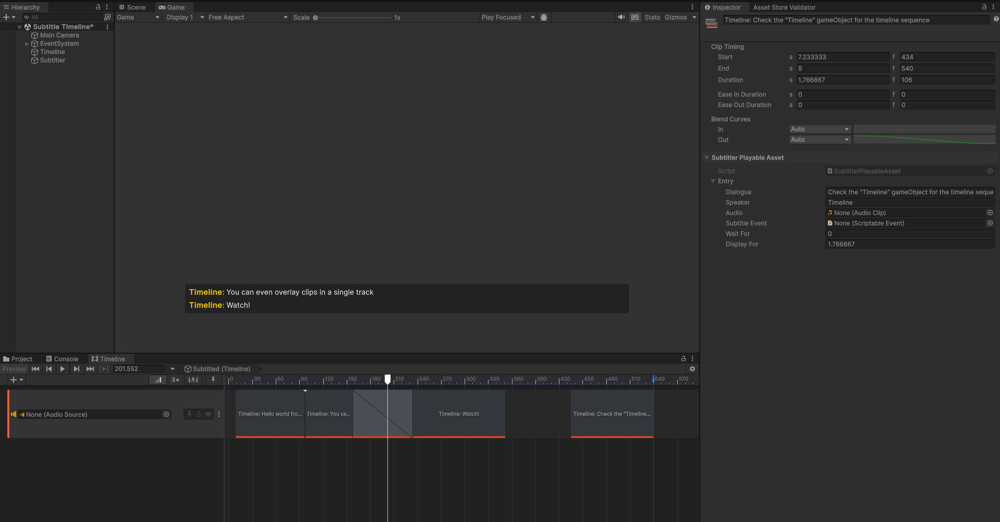

# Timeline

[Timeline](https://unity.com/features/timeline) is Unity's sequencing tool to handle complex event playback including Audio, Animations, C# Events and custom tracks. Subtitler comes with an optional Timeline integration allowing you to embed subtitles into your Timeline tracks. (The integration will enable itself automatically using scripting symbols).

## Importing Timeline
If you do not have Unity Timeline in your project, import it using Unity Package Manager by navigating into Unity Registry/Timeline and press import.

