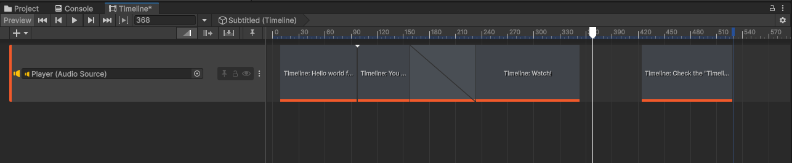
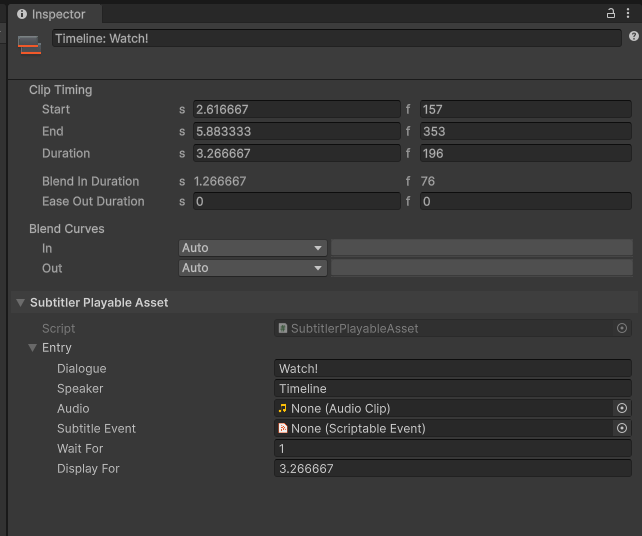

# Subtitler Track
Think of a Subtitler track like a Subtitler Sequence left to right. You can create an Subtitler under *+/Gasimo.Subtitler.Timeline/Subtitler Track*.

## Subtitler Entry (Clip)
You can add entries on the timeline by right clicking anywhere on the Subtitler Track and selecting *'Add Subtitler Playable Asset'*.

### Timing
Subtitler Entry timing works a little differently on the Timeline compared to Subtitle Sequences. Timing is loaded automatically from the Clip timing (An entry gets triggered at the exact time its played by the Timeline and lasts depending on the length of the clip). Changing the WaitFor property of the Entry will result in the Entry having a delay and be out of sync with the Timeline.